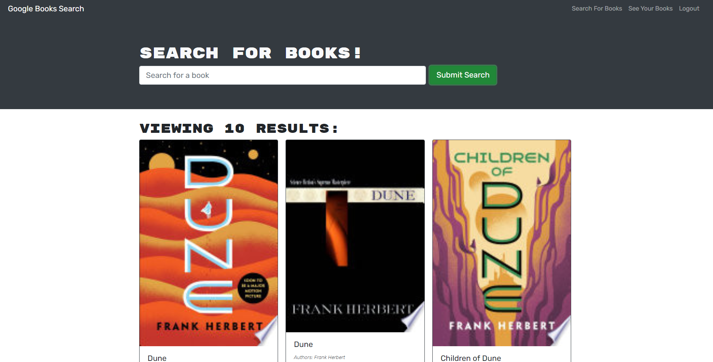

# Book Search Engine 

## Description 
Book Search Engine is an Apollo and React based application that allows users to browse Google Books API and choose books to save and display in their own, unique account pages. 

 ## Link to Deployed Application
* [Book Search Engine]()
### User Story
* AS AN avid reader
* I WANT to search for new books to read
* SO THAT I can keep a list of books to purchase 

## Table of Contents
* [Installation](#installation) 
* [Usage](#usage) 
* [License](#license) 
* [Contributing](#contributing)
* [Questions](#questions)

## Link to Github Repository
* [Book Search Engine](https://github.com/mplumer/book-search-engine)

 
### Installation
Follow the deployed application link: . 

### Usage
Type the title of a book that interests you into the search bar field. After clicking the search button, click the save button of books you want to keep in your wishlist.  

### License
MIT
  
### Contributing
Book Search Engine is an open source project that was built from cloned, front-end starter code at the University of Texas Web Development Bootcamp, and anyone is encouraged to contribute by cloning or forking the code and working to improve its function and versatility.

### Questions
    
##### Interested in other projects from this developer? Visit the following GitHub page:
https://github.com/mplumer
    
##### Send any questions to the following email address:
maxplumer12@gmail.com
